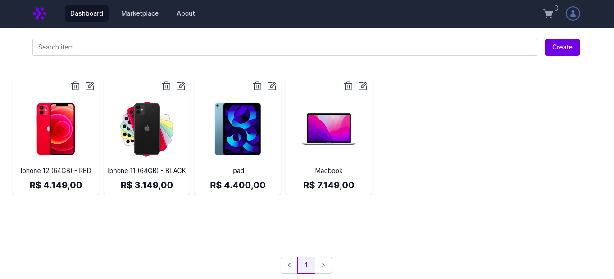
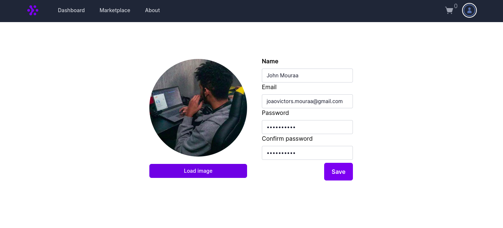
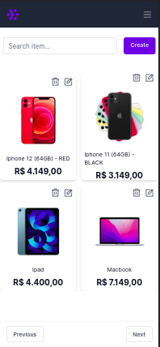
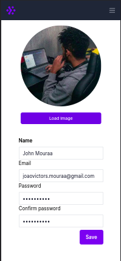

# Next Ecommerce🚀

<p>
  Its a simple ecommerce when we have 2 types of user, Admin User and normal user. The Admin have access on Dashboard page, when we can create new items on the Marketplace page and the user only have access on the other's pages
</p>

<p>
  This project have the main database where we have all users registred and all items of marketplace.
</p>

<p>
  The project have authentication system with cookies, tokens and nextAuth.
</p>


## OBS: If u wanna run this project localy u will need create one SQLite db on */prisma*


<br />

## Installation

### Clone

```
git clone https://github.com/jovimoura/ecommerce-next
```

### Access the folder

```
cd <name-folder>
```

### Install dependencies

```
npm i
```

### Start the app

```
npm run dev
```

### Port:

```
http://localhost:3000/
```

<br />

## Images of project

<br />

### Desktop:



<br >



### Responsive: 



<br >



<br />

## Tecnologies and Libs:

<ul>
    <li>Next</li>
    <li>TypeScript</li>
    <li>Tailwind</li>
    <li>Phosphoricons</li>
    <li>Headlessui</li>
    <li>Axios</li>
    <li>Redux</li>
    <li>Next-auth</li>
    <li>Nookies</li>
    <li>UUID</li>
    <li>Prisma</li>
    <li>Axios</li>
</ul>

<br />

## Made by:

### João Victor dos Santos Moura

### E-mail: joaovictors.mouraa@gmail.com

### Linkedin: https://www.linkedin.com/in/jovimoura10/
