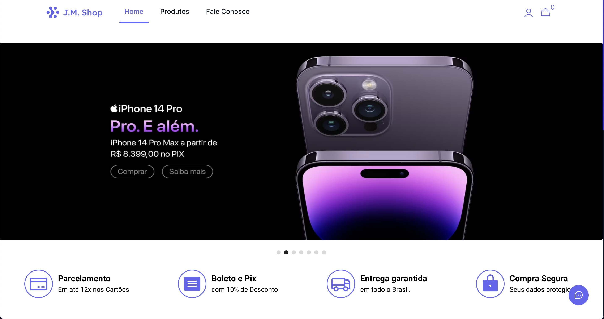
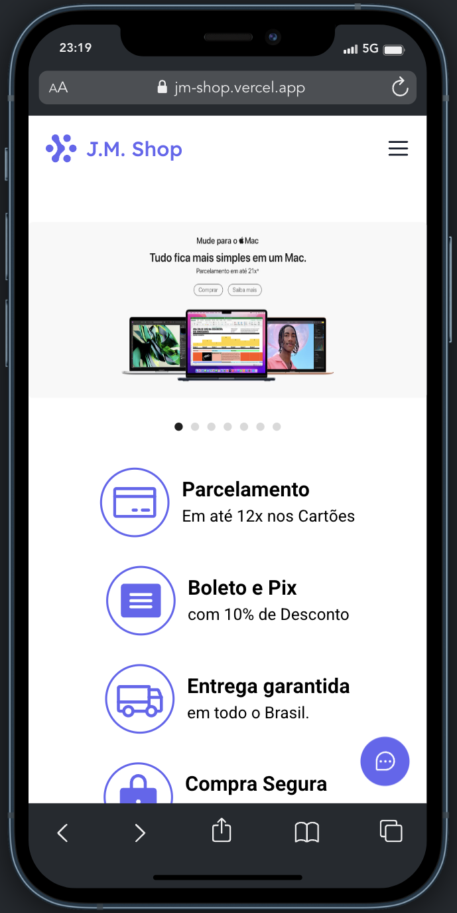

# J.M. Shop🚀

<p>
  It's a simple e-commerce created and invented by me.
</p>

<p>
  I use Next.js, Redux, Prisma, GraphQL, Nookies, HTML2Canvas Tailwind and TypeScript.
</p>

<p>
  The project have authentication system with cookies and tokens.
</p>

<br />

# Installation

## Clone

```
git clone https://github.com/jovimoura/ecommerce-next
```

## Access the folder

```
cd <name-folder>
```

## Install dependencies

```
npm i
```

## Start the app

```
npm run dev
```

## Port:

```
http://localhost:3000/
```

<br />

## Images of project

<br />

## Desktop:



## Responsive: 



<br />

## Tecnologies and Libs:

<ul>
    <li>Next</li>
    <li>TypeScript</li>
    <li>Tailwind</li>
    <li>HTML2Canvas</li>
    <li>Keen Slider</li>
    <li>Phosphoricons</li>
    <li>Axios</li>
    <li>Redux</li>
    <li>Next-auth</li>
    <li>Nookies</li>
    <li>UUID</li>
    <li>Prisma</li>
    <li>GraphQL</li>
    <li>Axios</li>
</ul>

<br />

# Made by:

## João Victor dos Santos Moura

## E-mail: joaovictors.mouraa@gmail.com

## Linkedin: https://www.linkedin.com/in/jovimoura10/

## Portfolio: https://portfolio-jovimoura.vercel.app/
